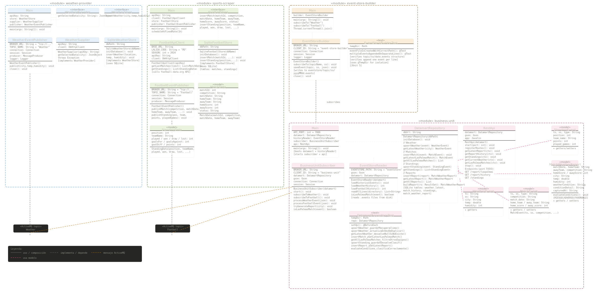

# Proyecto DACD — UD Las Palmas Weather & Football Analyser

**Grado en Ciencia e Ingeniería de Datos · ULPGC**  
**Asignatura: Desarrollo de Aplicaciones para Ciencia de Datos**

---

## Descripción

Sistema de captura, procesamiento y explotación de datos en tiempo real que combina
**datos meteorológicos de Las Palmas de Gran Canaria** con **resultados y clasificación
de la UD Las Palmas en LaLiga** para generar informes automáticos sobre las condiciones
climáticas en los partidos del equipo.

### Propuesta de valor

Dado un partido de la UD Las Palmas, el sistema responde: *¿qué condiciones
climáticas había en Las Palmas en el momento de ese partido?* Esto permite analizar
si el clima local puede correlacionarse con el rendimiento del equipo como local, y
sirve como base para estudios más completos en iteraciones futuras.

---

## Arquitectura del sistema

El proyecto sigue una **arquitectura Lambda** con tres capas:

```
┌──────────────────┐     ┌──────────────────┐
│  weather-provider│     │  sports-scraper  │
│  (OpenWeatherMap)│     │  (football-data) │
└────────┬─────────┘     └────────┬─────────┘
         │  publica JSON           │  publica JSON
         │  topic: Weather         │  topic: Football
         └──────────┬──────────────┘
                    ▼
           ┌────────────────┐
           │  Apache ActiveMQ│  (broker tcp://localhost:61616)
           └────────┬───────┘
                    │
         ┌──────────┴──────────┐
         ▼                     ▼
┌─────────────────┐   ┌──────────────────────┐
│event-store-build│   │    business-unit      │
│  (.events files)│   │  (datamart + REST API)│
└─────────────────┘   └──────────────────────┘
```

El **event-store-builder** persiste todos los eventos en ficheros NDJSON organizados por
fecha. El **business-unit** se suscribe en tiempo real al broker y, al arrancar, carga
también los eventos históricos del event store para reconstruir el datamart.

### Diagrama de clases



---

## Módulos

| Módulo | Responsabilidad |
|---|---|
| `weather-provider` | Consulta OpenWeatherMap cada hora y publica eventos de clima en el topic `Weather` |
| `sports-scraper` | Consulta football-data.org cada hora y publica partidos y clasificación de LaLiga en el topic `Football` |
| `event-store-builder` | Suscriptor durable que persiste todos los eventos en `eventstore/{topic}/{ss}/{YYYYMMDD}.events` |
| `business-unit` | Suscriptor durable que mantiene un datamart SQLite y expone una API REST en el puerto 7000 |

---

## Fuentes de datos

### OpenWeatherMap API

- **URL:** `https://openweathermap.org/api`
- **Dato capturado:** temperatura (°C) y humedad (%) de Las Palmas de Gran Canaria
- **Frecuencia:** cada hora
- **Topic ActiveMQ:** `Weather`

### football-data.org API

- **URL:** `https://www.football-data.org`
- **Dato capturado:** partidos de la UD Las Palmas en LaLiga 2024/25 y clasificación
- **Frecuencia:** cada hora
- **Topic ActiveMQ:** `Football`

---

## Justificación de la elección de APIs

### OpenWeatherMap

Se eligió esta API por su gratuidad, su amplia documentación y la variabilidad temporal
de sus datos (temperatura y humedad cambian cada hora), lo que la hace ideal para
capturas periódicas. Además, ofrece datos para cualquier ciudad del mundo, permitiendo
centrar el análisis en Las Palmas de Gran Canaria de forma directa.

### football-data.org

Se eligió esta API porque proporciona datos estructurados y actualizados de LaLiga,
incluyendo partidos y clasificación, sin necesidad de scraping frágil sobre HTML.
La combinación con datos meteorológicos tiene una propuesta de valor clara: analizar
si las condiciones climáticas en Las Palmas correlacionan con el rendimiento local
de la UD Las Palmas.

### Justificación del datamart

El datamart se implementa en SQLite porque es ligero, no requiere servidor externo y
es suficiente para el volumen de datos manejado. Se diseñaron cuatro tablas:

- `weather_latest`: upsert del clima actual, para consultas rápidas del estado presente.
- `match_history`: historial acumulativo de partidos de la UD Las Palmas.
- `standings`: clasificación actualizada de LaLiga (upsert por posición).
- `match_weather_report`: informes combinados generados automáticamente al cruzar un partido con el clima capturado en ese momento, núcleo de la propuesta de valor.

---

## Principios y patrones de diseño

### Patrón Publisher/Subscriber (Sprint 2 y 3)

Los módulos `weather-provider` y `sports-scraper` actúan como **publishers**: publican
eventos JSON en topics de ActiveMQ (`Weather` y `Football`) sin conocer quién los consume.
El `event-store-builder` y el `business-unit` actúan como **subscribers** desacoplados,
procesando los eventos de forma independiente. Este desacoplamiento permite añadir nuevos
consumidores sin modificar los feeders.

### Patrón Repository

Cada módulo de persistencia implementa una interfaz (`WeatherStore`, `FootballStore`,
`DatamartRepository`) que abstrae el acceso a datos. Las clases concretas
(`SqliteWeatherStore`, `SqliteFootballStore`) implementan esa interfaz, de forma que
el resto del código depende de la abstracción y no de la implementación concreta.
Esto facilita sustituir SQLite por otro motor sin tocar la lógica de negocio.

### Principio de segregación de interfaces (ISP)

Las interfaces están diseñadas con responsabilidades mínimas y específicas:
`WeatherStore` solo define operaciones de clima, `FootballStore` solo de fútbol,
y `WeatherProvider` solo la obtención de datos externos. Ninguna clase implementa
métodos que no necesita.

### Principio de responsabilidad única (SRP)

Cada clase tiene una única razón para cambiar:

- `WeatherSupplier`: solo obtiene datos de la API externa.
- `WeatherEventPublisher`: solo publica eventos en ActiveMQ.
- `SqliteWeatherStore`: solo persiste datos en SQLite.
- `EventStoreBuilder`: solo almacena eventos en ficheros NDJSON.
- `RestApi`: solo gestiona los endpoints HTTP.

### Arquitectura Lambda

El sistema sigue una arquitectura Lambda con dos capas de procesamiento:

- **Capa de velocidad**: `business-unit` consume eventos en tiempo real desde ActiveMQ y actualiza el datamart inmediatamente.
- **Capa de lote**: al arrancar, `business-unit` lee los ficheros `.events` históricos del event store para reconstruir el datamart, garantizando coherencia aunque el proceso haya estado parado.

---

## Estructura del Event Store

```
eventstore/
├── Weather/
│   └── weather-provider/
│       ├── 20260509.events
│       └── 20260510.events
└── Football/
    └── sports-scraper/
        ├── 20260509.events
        └── 20260510.events
```

Cada fichero `.events` contiene un evento JSON por línea (formato NDJSON).

Ejemplo de evento de clima:

```json
{"ts":"2026-05-09T10:00:00Z","ss":"weather-provider","city":"Las Palmas","temp":22.4,"humidity":68}
```

Ejemplo de evento de partido:

```json
{"ts":"2026-05-09T10:00:00Z","ss":"sports-scraper","type":"match","competition":"Primera Division","match_date":"2026-04-20T18:00:00Z","home_team":"UD Las Palmas","away_team":"FC Barcelona","home_score":1,"away_score":2}
```

---

## API REST — Business Unit

El módulo `business-unit` arranca un servidor HTTP en el puerto **7000** con los
siguientes endpoints:

| Método | Endpoint | Descripción |
|---|---|---|
| GET | `/` | Listado de endpoints disponibles |
| GET | `/report/laspalmas` | Informe combinado: último partido + clima en ese momento |
| GET | `/report/history` | Historial completo de informes generados |
| GET | `/standings` | Clasificación actual de LaLiga |
| GET | `/weather/current` | Último dato de clima capturado para Las Palmas |
| GET | `/matches/laspalmas` | Historial de partidos de la UD Las Palmas |

### Ejemplo de respuesta — `/report/laspalmas`

```json
{
  "partido": {
    "fecha": "2026-04-20T18:00:00Z",
    "local": "UD Las Palmas",
    "visitante": "FC Barcelona",
    "competicion": "Primera Division",
    "resultado": "1 - 2"
  },
  "clima": {
    "ciudad": "Las Palmas",
    "temp_c": 22.4,
    "humedad_%": 68
  },
  "valoracion": {
    "condicion": "FAVORABLE",
    "detalle": "Temperatura agradable y humedad moderada"
  },
  "generado_en": "2026-05-09T10:05:00Z"
}
```

---

## Cómo ejecutar el proyecto

### Requisitos previos

- Java 21
- Maven 3.8+
- Apache ActiveMQ 5.15.x instalado y corriendo en `tcp://localhost:61616`

### 1. Arrancar ActiveMQ

```bash
# Linux / macOS
bin/activemq start

# Windows
bin\activemq.bat start
```

Verificar en el panel de administración: `http://localhost:8161`  
(usuario: `admin`, contraseña: `admin`)

### 2. Compilar el proyecto

Desde la raíz del proyecto multimódulo:

```bash
mvn clean package -DskipTests
```

### 3. Arrancar los módulos

Cada módulo se ejecuta en una terminal distinta, en este orden:

**Terminal 1 — Event Store Builder:**
```bash
cd event-store-builder
java -jar target/event-store-builder-1.0-SNAPSHOT.jar
```

**Terminal 2 — Weather Provider:**
```bash
cd weather-provider
java -jar target/weather-provider-1.0-SNAPSHOT.jar <OPENWEATHER_API_KEY>
```

**Terminal 3 — Sports Scraper:**
```bash
cd sports-scraper
java -jar target/sports-scraper-1.0-SNAPSHOT.jar <FOOTBALLDATA_API_KEY>
```

**Terminal 4 — Business Unit:**
```bash
cd business-unit
java -jar target/business-unit-1.0-SNAPSHOT.jar
```

### 4. Probar la API REST

```bash
# Informe más reciente
curl http://localhost:7000/report/laspalmas

# Clasificación de LaLiga
curl http://localhost:7000/standings

# Clima actual
curl http://localhost:7000/weather/current

# Partidos de Las Palmas
curl http://localhost:7000/matches/laspalmas
```

O abrir directamente en el navegador: `http://localhost:7000`

---

## Diseño del Datamart

El datamart se implementa en **SQLite** (`datamart.db`) con cuatro tablas:

| Tabla | Contenido |
|---|---|
| `weather_latest` | Último dato de clima por ciudad (upsert) |
| `match_history` | Historial de partidos de la UD Las Palmas |
| `standings` | Clasificación actual de LaLiga (upsert por posición) |
| `match_weather_report` | Informes combinados partido + clima generados automáticamente |

La estrategia de reconstrucción al arrancar consiste en leer todos los ficheros
`.events` del event store e insertarlos en el datamart antes de comenzar la
suscripción en tiempo real, garantizando coherencia aunque el proceso haya estado
parado.

---

## Datos de ejemplo

### Muestra del Event Store

Fichero `eventstore/Weather/weather-provider/20260509.events`:

```json
{"ts":"2026-05-09T10:00:00Z","ss":"weather-provider","city":"Las Palmas","temp":22.4,"humidity":68}
{"ts":"2026-05-09T11:00:00Z","ss":"weather-provider","city":"Las Palmas","temp":23.1,"humidity":65}
{"ts":"2026-05-09T12:00:00Z","ss":"weather-provider","city":"Las Palmas","temp":24.0,"humidity":61}
```

Fichero `eventstore/Football/sports-scraper/20260509.events`:

```json
{"ts":"2026-05-09T10:00:00Z","ss":"sports-scraper","type":"match","competition":"Primera Division","match_date":"2024-10-21T19:00:00Z","home_team":"UD Las Palmas","away_team":"Valencia CF","home_score":3,"away_score":2}
{"ts":"2026-05-09T10:00:00Z","ss":"sports-scraper","type":"standing","position":1,"team_name":"FC Barcelona","points":88,"played_games":38}
{"ts":"2026-05-09T10:00:00Z","ss":"sports-scraper","type":"standing","position":18,"team_name":"UD Las Palmas","points":31,"played_games":38}
```

### Muestra del Datamart (tabla `match_weather_report`)

| match_date | home_team | away_team | home_score | away_score | temp_c | humidity | condition |
|---|---|---|---|---|---|---|---|
| 2024-10-21 | UD Las Palmas | Valencia CF | 3 | 2 | 18.4 | 73 | FAVORABLE |
| 2024-10-05 | RC Celta de Vigo | UD Las Palmas | 1 | 0 | 17.2 | 80 | FAVORABLE |

---

## Tecnologías utilizadas

| Tecnología | Uso |
|---|---|
| Java 21 | Lenguaje principal |
| Maven | Gestión de dependencias y build |
| Apache ActiveMQ 5.15 | Broker de mensajería (Publisher/Subscriber) |
| SQLite + JDBC | Persistencia en Sprint 1 y datamart |
| OkHttp | Cliente HTTP para las APIs |
| Gson | Serialización / deserialización JSON |
| Javalin | Servidor HTTP para la API REST |

---

## Autores

Lucía Hernández y Amai Suárez — Grado en Ciencia e Ingeniería de Datos, ULPGC
